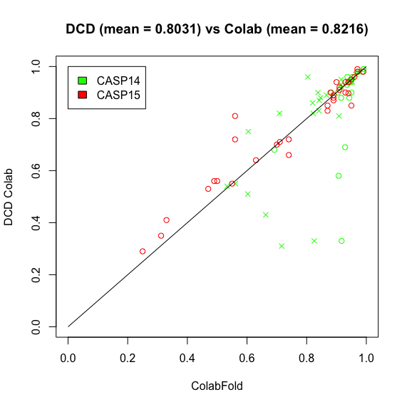
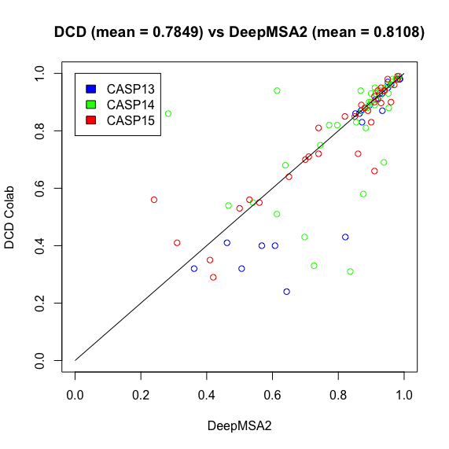

# ColabFold and the DeepClust Database
To make use of the DeepClust Database in the context of Protein Structure Prediction, we provide a script to replace the ColabFold Database with the DeepClust Database.
 The ColabFold Pipeline consist of two main steps: First the query is aligned against the UniRef30 Database Centroids and second alignment of the resulting profile against the centroids of the ColabFold Database. Then, based on the alignment results, relevant sequences are extracted from the clusters. Because these steps need the alignment results from the clustering, in the DeepClust pipeline the latest profile is again aligned against all the extracted sequences.

## Options:
[-h]  
*show this help message and exit*  
[-path_to_query PATH_TO_QUERY]  
*Path to query (Profile or sequence)*  
[-path_to_mmseqs PATH_TO_MMSEQS]  
*Path to MMseqs*  
[-path_to_DCD PATH_TO_DCD]  
*Location of the DeepClust database in parquet format*  
[-path_to_centroids PATH_TO_CENTROIDS]  
*Path to DeepClust centroids in MMseqs format*  
[--path_to_uniref PATH_TO_UNIREF]  
*Path to UniRef30 in MMseqs format*  
[-path_to_DCD_index PATH_TO_DCD_INDEX]  
*Location of the DeepClust index*  
[-path_to_output PATH_TO_OUTPUT]  
*Path to output*  
[-path_to_tmp PATH_TO_TMP]  
*Path to temporary directory*  
[--threads THREADS]  
*Threads*  

## Example:
This call executes the ColabFold search against first the Uniref30 Database and then the DeepClust Database.
The query sequences here are a few targets from recent [CASP](https://predictioncenter.org/index.cgi) experiments, which were mentioned in the [DeepMSA2](https://www.nature.com/articles/s41592-023-02130-4) publication.
Not all of these could be evaluated since CASP hasn't released all the templates yet.
~~~ 
python3 /PATH/TO/DCD_MMseqs2.py --threads 32 -path_to_query /PATH/TO/casp13_14_15.mm -path_to_mmseqs /PATH/TO/mmseqs -path_to_DCD /PATH/TO/DeepClustParquet/joined_with_index_RowGroupFinal.parquet -path_to_centroids /PATH/TO/DeepClustCentroids/clust_bigg_2.mmseqs --path_to_uniref /PATH/TO/mmseqs_db/uniref30_2302_db -path_to_DCD_index /PATH/TO/clust_index_RowGroup.parquet -path_to_output /PATH/TO/Output/ -path_to_tmp /PATH/TO/dcd_colab_tmp/
~~~ 

This took around 1 hour and 50 minutes on 32 Threads.  
Evaluation of the results was done with [TMalign](https://zhanggroup.org/TM-align/).  
#### TM scores DeepClust against Colabfold:  
Crosses are CASP targets on which Colabfold was optimized.
  
On the CASP14 targets, Colabfold outperforms the DeepClust Pipeline.
Interestingly the DeepClust Pipeline performs slightly better on CASP15 targets.

#### TM scores DeepClust against DeepMSA2:  
  
DeepMSA2 outperforms the DeepClust pipeline.
Still, there are a few targets for which the less sensitive DeepClust pipeline can produce better predictions than DeepMSA2.

Therefore, including the DeepClust Database in protein structure, prediction pipelines can in some cases yield better results.
The pipeline can compete with ColabFold and is faster than the DeepMSA2 pipeline.

DeepMSA2 scores were collected from their [Publication](https://www.nature.com/articles/s41592-023-02130-4).  
ColabFold results were collected from [1] and [CASP](https://predictioncenter.org/index.cgi).

## References:
[1] ColabFold (Mirdita, M., Schütze, K., Moriwaki, Y. et al. ColabFold: making protein folding accessible to all. Nat Methods 19, 679–682 (2022). https://doi.org/10.1038/s41592-022-01488-1)  
[2] MMseqs2 (Steinegger, M., Söding, J. MMseqs2 enables sensitive protein sequence searching for the analysis of massive data sets. Nat Biotechnol 35, 1026–1028 (2017). https://doi.org/10.1038/nbt.3988)  
[3] DIAMONDv2 (Buchfink, B., Reuter, K. & Drost, HG. Sensitive protein alignments at tree-of-life scale using DIAMOND. Nat Methods 18, 366–368 (2021). https://doi.org/10.1038/s41592-021-01101-x)  
[4] DIAMOND DeepClust ( Sensitive clustering of protein sequences at tree-of-life scale using DIAMOND DeepClust Benjamin Buchfink, Haim Ashkenazy, Klaus Reuter, John A. Kennedy, Hajk-Georg Drost bioRxiv 2023.01.24.525373; doi: https://doi.org/10.1101/2023.01.24.525373)  
[5] DeepMSA2 (Zheng, W., Wuyun, Q., Li, Y. et al. Improving deep learning protein monomer and complex structure prediction using DeepMSA2 with huge metagenomics data. Nat Methods 21, 279–289 (2024). https://doi.org/10.1038/s41592-023-02130-4)
